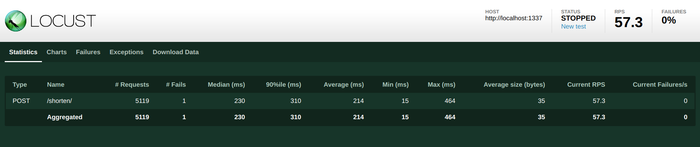
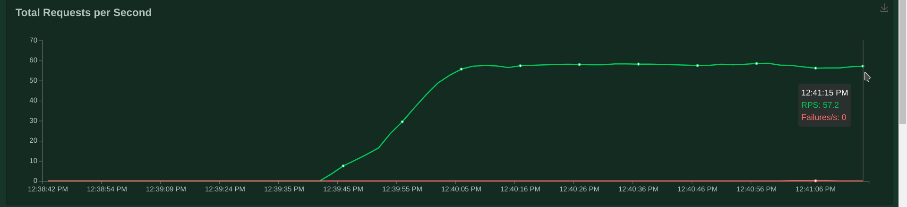
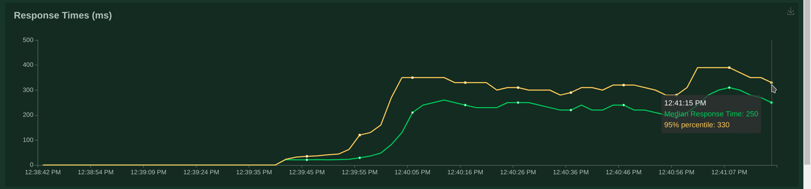

# Simple url shortener

Простой сервис укорачивания ссылок.  
Доступна возможность задавать свои имена укорачиваемым ссылкам.

Доступен на бесплатном хостинге:

http://rrrrs09.pythonanywhere.com/

# Использование

Конечная точка `/shorten/`  
Тип данных `application/json`

### Запрос
В теле запроса указывается `url` и `slug` (опционально)  
Поле `slug` может состоять из букв латинского алфавита, цифр, нижних подчеркиваний и тире.

Примеры запросов:
```
curl -X POST 'http://rrrrs09.pythonanywhere.com/shorten/' \
     -H 'Content-Type: application/json' \
     -d '{
       "url": "https://example.com/path/to/file"
     }'
```
```
curl -X POST 'http://rrrrs09.pythonanywhere.com/shorten/' \
     -H 'Content-Type: application/json' \
     -d '{
       "url": "https://example.com/path/to/file",
       "slug": "my_example"
     }'
```

### Ответ
Коды ответов:
- код `201`. Возвращается укороченная ссылка. Пример:
```javascript
{
    url: 'http://rrrrs09.pythonanywhere.com/jfk7bG'
}
```
```javascript
{
    url: 'http://rrrrs09.pythonanywhere.com/my_example'
}
```
- код `400`. Ошибка обработки тела запроса. Пример:
```javascript
{
    "error": {
        "message": "json processing problems",
        "code": "invalid_json"
    }
}
```
- код `422`. Ошибка валидации данных. Пример:
```javascript
{
    "errors": {
        "url": [
            {
                "message": "Enter a valid URL.",
                "code": "invalid"
            }
        ],
        "slug": [
            {
                "message": "Enter a valid “slug” consisting of letters, numbers, underscores or hyphens.",
                "code": "invalid"
            }
        ]
    }
}
```
Коды ошибок для поля `url`:
- _"required"_ - _"This field is required."_;
- _"invalid"_ - _"Enter a valid URL."_;
- _"service_url"_ - _"This link is already shortened."_

Коды ошибок для поля `slug`:
- _"invalid"_ - _"Enter a valid “slug” consisting of letters, numbers, underscores or hyphens."_;
- _"already_exists"_ - _"This slug is already in use."_;
- _"max_length"_ - _"Ensure this value has at most 50 characters (it has 57)."_

# Запуск проекта

Для запуска локально должны быть установлены:
- docker
- docker-compose

---

## Сборка для локального запуска

Запуск производится с помощью команды:

    docker-compose -f docker-compose.dev.yml up

Далее необходимо перейти по адресу [127.0.0.1:8000](http://127.0.0.1:8000)  
При таком запуске будет использоваться встроенный Django сервер и СУБД sqlite3

## Сборка для деплоя

Запуск производится с помощью команды:

    docker-compose -f docker-compose.prod.yml up

Далее необходимо перейти по адресу [127.0.0.1:1337](http://127.0.0.1:1337)  
При таком запуске будут использоваться nginx, gunicorn и PostgreSQL

# Нагрузочное тестирование

Нагрузочное тестирование проводилось с использованием библиотеки __Locust__ и production сборки.

### Результаты:

Имитировалась нагрузка с использованием 100 пользователей. Каждый пользователь отправлял запрос раз в 1-2 секунды.

За время теста было выполнено около 5000 запросов. Обрабатывалось около 60 запросов в секунду.

Общие результаты:


Количество запросов в секунду:


Время ответа сервера:


---

## Запуск нагрузочного тестирования

Чтобы запустить тестирование необходимо выполнить установку пакета:

    pip3 install locust

далее необходимо запустить production сборку:

    docker-compose -f docker-compose.prod.yml up

запустить командой:

    locust -f backend/locust_files/locustfile.py --host=http://localhost:1337

перейти по адресу [0.0.0.0:8089](http://0.0.0.0:8089),
ввести общее количество пользователей и количество пользователей, появляющихся каждую секунду и запустить тестирование.